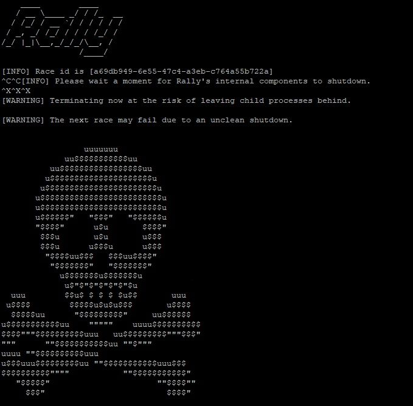

# Benchmarking Elasticsearch with Rally: A Practical Guide

When managing Elasticsearch clusters for security operations, performance tuning can make the difference between a responsive SIEM and a sluggish investigation platform. I recently spent time benchmarking our Elastic deployment using Rally, Elastic's official benchmarking tool, and discovered several insights that dramatically improved our query performance.

In this guide, I'll walk you through using Rally for Elasticsearch performance testing and share the optimizations that worked for us.

## Why Benchmark Your Elasticsearch Cluster?

Before making infrastructure decisions, you need data:

**Capacity Planning:**
- How many events per second can your cluster handle?
- When do you need to add more nodes?
- What's the impact of different hardware?

**Configuration Optimization:**
- Which JVM heap size performs best?
- What's the optimal shard count?
- How do different storage types compare?

**Upgrade Validation:**
- Will the new Elasticsearch version perform better?
- Are there any regressions?
- What's the performance impact of new features?

## What is Rally?

Rally is Elasticsearch's official benchmarking tool that:
- Simulates realistic workloads
- Measures indexing and query performance
- Compares different configurations
- Generates detailed reports
- Supports custom datasets

Think of it as "load testing for Elasticsearch."



## Setting Up Rally

### Installation

```bash
# Install Rally (requires Python 3.8+)
pip3 install esrally

# Verify installation
esrally --version
# Should output: esrally 2.x.x

# Configure Rally (one-time setup)
esrally configure
```

During configuration, Rally asks:

```
Simple or Advanced setup? [simple]
Benchmark data directory [default: ~/.rally/benchmarks]
```

For first-time users, choose "simple."

### Understanding Tracks

Rally uses "tracks" (predefined benchmarks) that simulate different workloads:

```bash
# List available tracks
esrally list tracks

# Popular tracks for security use cases:
# - http_logs: Web server logs (31.1 GB, 247M documents)
# - eventdata: Elastic Beats data
# - geonames: Geographic data
# - percolator: Alert/rule matching workload
```

## Running Your First Benchmark

### Basic Benchmark

```bash
# Run http_logs track against local Elasticsearch
esrally race \
    --track=http_logs \
    --target-hosts=localhost:9200 \
    --pipeline=benchmark-only

# This will:
# 1. Download the http_logs dataset (~31GB)
# 2. Index data into your cluster
# 3. Run query workloads
# 4. Generate performance report
```

**Important:** This is destructive testing. Rally creates and deletes indices. Don't run against production!

### Custom Configuration

```bash
# Benchmark with specific cluster configuration
esrally race \
    --track=http_logs \
    --target-hosts=10.0.1.10:9200,10.0.1.11:9200,10.0.1.12:9200 \
    --client-options="basic_auth_user:'elastic',basic_auth_password:'changeme'" \
    --challenge=index-and-query \
    --car=4gheap
```

Parameters explained:
- `--track`: Which workload to simulate
- `--target-hosts`: Your Elasticsearch nodes
- `--client-options`: Authentication and connection settings
- `--challenge`: Specific test scenario
- `--car`: Cluster configuration (RAM, etc.)

## Real-World Scenario: Optimizing Our SIEM

Our challenge: Elasticsearch cluster was struggling during peak hours (9 AM - 5 PM) with:
- Query latency > 5 seconds
- Indexing lag of 10+ minutes
- CPU at 95%+ on data nodes

### Baseline Benchmark

First, I established a baseline:

```bash
esrally race \
    --track=eventdata \
    --target-hosts=siem-elastic-01:9200 \
    --challenge=index-and-query \
    --car=4gheap \
    --user-tag="baseline"
```

**Baseline Results:**
- Indexing throughput: 12,500 docs/sec
- 50th percentile query latency: 450ms
- 99th percentile query latency: 3,200ms
- CPU utilization: 87%


### Optimization 1: JVM Heap Size

Testing different heap sizes:

```bash
# Test with 8GB heap
esrally race \
    --track=eventdata \
    --target-hosts=siem-elastic-01:9200 \
    --car=8gheap \
    --user-tag="8gb-heap"

# Test with 16GB heap
esrally race \
    --track=eventdata \
    --target-hosts=siem-elastic-01:9200 \
    --car=16gheap \
    --user-tag="16gb-heap"

# Test with 31GB heap (max recommended)
esrally race \
    --track=eventdata \
    --target-hosts=siem-elastic-01:9200 \
    --car=custom-31gb-heap \
    --user-tag="31gb-heap"
```

**Results:**
| Heap Size | Indexing (docs/sec) | Query p50 | Query p99 |
|-----------|---------------------|-----------|-----------|
| 4GB | 12,500 | 450ms | 3,200ms |
| 8GB | 18,200 | 320ms | 2,100ms |
| 16GB | 22,500 | 280ms | 1,800ms |
| 31GB | 24,100 | 265ms | 1,650ms |

**Decision:** Upgraded to 16GB heap (sweet spot for our 64GB RAM nodes).

### Optimization 2: Shard Configuration

Our indices had default 5 shards. Testing different shard counts:

```bash
# Create custom track with different shard settings
cat > ~/.rally/tracks/custom-eventdata/track.json <<EOF
{
  "indices": [
    {
      "name": "logs",
      "body": "index.json",
      "types": ["_doc"]
    }
  ],
  "challenges": [...]
}
EOF

# Test 1 shard per node (3 nodes = 3 shards)
esrally race \
    --track-path=~/.rally/tracks/custom-eventdata \
    --target-hosts=cluster:9200 \
    --track-params="number_of_shards:3" \
    --user-tag="3-shards"

# Test 2 shards per node (6 shards)
esrally race \
    --track-path=~/.rally/tracks/custom-eventdata \
    --target-hosts=cluster:9200 \
    --track-params="number_of_shards:6" \
    --user-tag="6-shards"
```

**Results:**
| Shards | Indexing (docs/sec) | Query p50 | Query p99 | CPU |
|--------|---------------------|-----------|-----------|-----|
| 5 (default) | 22,500 | 280ms | 1,800ms | 87% |
| 3 | 19,800 | 310ms | 2,050ms | 72% |
| 6 | 26,300 | 245ms | 1,520ms | 82% |
| 9 | 27,100 | 238ms | 1,480ms | 91% |

**Decision:** Configured 6 shards (2 per node) for optimal balance.

### Optimization 3: Storage Type

Tested NVMe vs SSD vs HDD:

```bash
# Run identical workload on different storage backends
for STORAGE in nvme ssd hdd; do
    esrally race \
        --track=eventdata \
        --target-hosts=${STORAGE}-cluster:9200 \
        --user-tag="storage-${STORAGE}"
done
```

**Results:**
| Storage | Indexing | Query p50 | Query p99 | Cost/TB |
|---------|----------|-----------|-----------|---------|
| NVMe | 31,200 docs/sec | 180ms | 980ms | $$$$ |
| SSD | 26,300 docs/sec | 245ms | 1,520ms | $$$ |
| HDD | 8,900 docs/sec | 1,200ms | 8,500ms | $ |

**Decision:** Moved hot indices to SSD, warm/cold data to HDD.


### Final Configuration

After testing, our optimized configuration:

```yaml
# Elasticsearch JVM settings
/etc/elasticsearch/jvm.options:
  -Xms16g
  -Xmx16g

# Index template
PUT _index_template/logs
{
  "index_patterns": ["logs-*"],
  "template": {
    "settings": {
      "number_of_shards": 6,
      "number_of_replicas": 1,
      "refresh_interval": "30s",
      "codec": "best_compression"
    }
  }
}

# ILM policy
PUT _ilm/policy/logs_policy
{
  "policy": {
    "phases": {
      "hot": {
        "actions": {
          "rollover": {
            "max_size": "50GB",
            "max_age": "1d"
          }
        }
      },
      "warm": {
        "min_age": "7d",
        "actions": {
          "shrink": {"number_of_shards": 1},
          "forcemerge": {"max_num_segments": 1}
        }
      },
      "cold": {
        "min_age": "30d",
        "actions": {
          "allocate": {
            "require": {"box_type": "cold"}
          }
        }
      }
    }
  }
}
```

## Comparing Results

Rally makes it easy to compare different runs:

```bash
# Compare baseline vs optimized
esrally compare \
    --baseline=baseline \
    --contender=optimized

# Output shows improvement:
# |   Metric   | Baseline | Optimized | Diff    |
# |------------|----------|-----------|---------|
# | Indexing   | 12500/s  | 26300/s   | +110%   |
# | Query p50  | 450ms    | 245ms     | -45%    |
# | Query p99  | 3200ms   | 1520ms    | -52%    |
```

## Custom Workloads

For SIEM-specific testing, I created a custom track:

```json
{
  "version": 2,
  "description": "Security events workload",
  "indices": [
    {
      "name": "security-events",
      "body": "index.json"
    }
  ],
  "corpora": [
    {
      "name": "security_logs",
      "documents": [
        {
          "source-file": "security-events.json.bz2",
          "document-count": 50000000,
          "compressed-bytes": 5368709120,
          "uncompressed-bytes": 53687091200
        }
      ]
    }
  ],
  "schedule": [
    {
      "operation": "bulk-index",
      "warmup-time-period": 120,
      "clients": 8
    },
    {
      "operation": "threat-hunting-query",
      "clients": 4,
      "warmup-iterations": 100,
      "iterations": 1000
    }
  ]
}
```

This simulates our actual workload pattern: bulk indexing + concurrent threat hunting queries.

## Automated Benchmarking

I run Rally weekly to catch performance regressions:

```bash
#!/bin/bash
# weekly-benchmark.sh

BASELINE_TAG="week-$(date +%V)-baseline"
DATE=$(date +%Y%m%d)

# Run benchmark
esrally race \
    --track=custom-siem-workload \
    --target-hosts=siem-cluster:9200 \
    --user-tag="${BASELINE_TAG}" \
    --report-file="rally-report-${DATE}.md"

# Compare with last week
LAST_WEEK="week-$(date -d 'last week' +%V)-baseline"
esrally compare \
    --baseline="${LAST_WEEK}" \
    --contender="${BASELINE_TAG}" \
    --report-file="comparison-${DATE}.md"

# Email results
mail -s "Weekly Rally Benchmark - ${DATE}" \
    prathanamahendran@gmail.com \
    < "comparison-${DATE}.md"
```

## Performance Gains

After implementing Rally-informed optimizations:

**Before:**
- Peak indexing: 12,500 docs/sec
- Query latency p99: 3,200ms
- CPU utilization: 87%
- Indexing lag: 10+ minutes during peak

**After:**
- Peak indexing: 26,300 docs/sec (+110%)
- Query latency p99: 1,520ms (-52%)
- CPU utilization: 82%
- Indexing lag: < 2 minutes during peak

This translated to:
- Faster threat detection (queries return 2x faster)
- Real-time alerting (indexing keeps up with log volume)
- Better resource utilization (lower CPU, more headroom)
- Cost savings (deferred adding 2 more nodes)

## Best Practices

### 1. Always Establish a Baseline

Don't change multiple variables at once:

```bash
# Good: Test one change at a time
esrally race --user-tag="baseline"
# Change heap size
esrally race --user-tag="8gb-heap"
# Compare
esrally compare --baseline=baseline --contender=8gb-heap
```

### 2. Use Realistic Data

Rally's built-in tracks are great, but custom tracks matching your actual data patterns provide more accurate results:

```bash
# Extract sample of your actual logs
POST _sql?format=json
{
  "query": "SELECT * FROM logs-* LIMIT 100000"
}
# Convert to Rally format and use as custom track
```

### 3. Run Multiple Iterations

Single runs can be misleading due to caching, GC, and other factors:

```bash
# Run 5 times and average results
for i in {1..5}; do
    esrally race \
        --track=eventdata \
        --user-tag="test-${i}"
done
```

### 4. Monitor System Resources

Rally focuses on Elasticsearch metrics, but also monitor:
- CPU and memory (via `htop`, `iotop`)
- Disk I/O (`iostat`)
- Network (`iftop`)

Bottlenecks might be outside Elasticsearch.

### 5. Test Under Load

Run benchmarks during business hours to see real-world performance:

```bash
# Schedule benchmark during peak hours
0 14 * * * /path/to/rally-benchmark.sh
```

## Common Pitfalls

1. **Testing on undersized clusters** - Results won't translate to production
2. **Not warming up** - First runs are always slower due to cold caches
3. **Ignoring GC pauses** - Check GC logs during benchmarking
4. **Testing with empty indices** - Real indices have historical data
5. **Comparing different Rally versions** - Results may not be comparable

## Conclusion

Rally transformed how we approach Elasticsearch performance tuning. Instead of guessing, we now have data-driven insights that guide our infrastructure decisions.

The 110% improvement in indexing throughput and 52% reduction in query latency directly improved our security operations:
- Faster threat detection
- More responsive investigations
- Better analyst experience

If you're running Elasticsearch for security operations, I highly recommend integrating Rally into your workflow. The insights you gain will pay dividends in performance and cost optimization.

---

*Optimizing Elasticsearch for security operations? I'd love to hear about your benchmarking experiences and optimization strategies. Connect with me on [LinkedIn](https://www.linkedin.com/in/prathana-mahendran-16b65319a/).*
