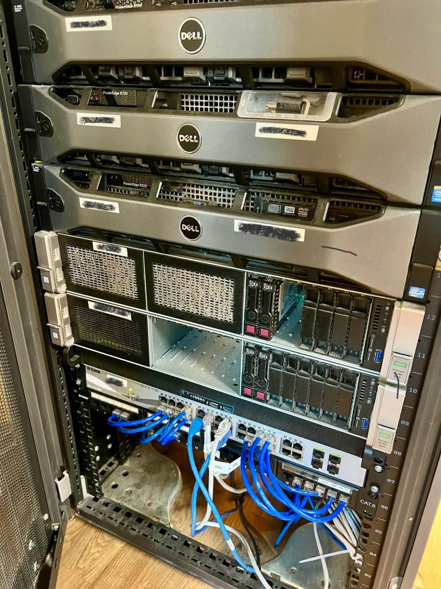
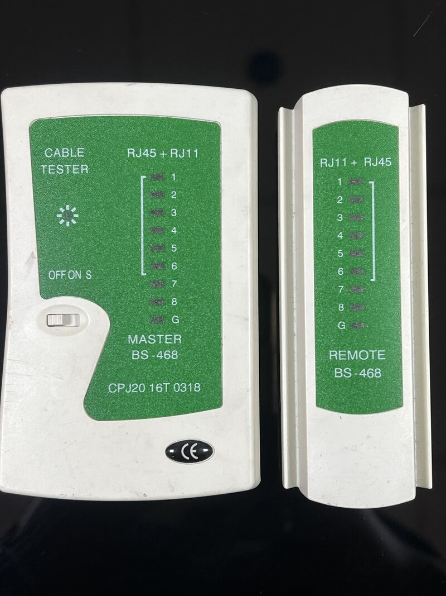

# Building a Home Lab: My Personal SOC Infrastructure

As a security professional, having a home lab is invaluable for testing, learning, and experimenting without the constraints of production environments. I recently set up a comprehensive home server infrastructure that serves as my personal SOC, development environment, and learning playground.

This post walks through my setup, the decisions I made, and lessons learned along the way.

## Why Build a Home Lab?

**Professional Development:**
- Test security tools without production risk
- Practice incident response scenarios
- Learn new technologies hands-on
- Build a portfolio of practical projects

**Cost Savings:**
- No cloud bills for personal projects
- One-time hardware investment
- Full control over resources

**Privacy:**
- Personal data stays local
- No external dependencies
- Complete control over security

## Hardware Setup

### Primary Server

**Specifications:**
- **CPU**: Intel i5-12600K (10 cores, 16 threads)
- **RAM**: 64GB DDR4 3200MHz
- **Storage**:
  - 1TB NVMe SSD (OS and VMs)
  - 4TB HDD (logs and long-term storage)
  - 2TB SSD (high-performance workloads)
- **Network**: 2.5GbE NIC
- **Power**: 750W PSU (80+ Gold)

**Cost**: ~$1,200 USD (prices vary by region)

### Network Equipment

- **Router**: pfSense on dedicated hardware
- **Switch**: Managed 24-port Gigabit switch
- **WiFi**: Separate AP for guest network isolation
- **Backup connectivity**: 4G LTE failover


## Software Stack

### Hypervisor: Proxmox VE

I chose Proxmox for several reasons:
- Open source and free
- Supports both VMs and containers
- Web-based management
- Built-in backup system
- Active community

```bash
# Installation (on bare metal)
# Download Proxmox VE ISO
# Boot from USB and follow installer

# Post-install: Update repositories
echo "deb http://download.proxmox.com/debian/pve bullseye pve-no-subscription" > /etc/apt/sources.list.d/pve-no-subscription.list
apt update && apt full-upgrade
```

### Virtual Machines

I run multiple VMs for different purposes:

**Security Stack (24/7 uptime)**
1. **pfSense** (2 vCPU, 4GB RAM)
   - Firewall
   - VPN server (WireGuard)
   - DNS filtering (pfBlockerNG)
   - Intrusion detection (Suricata)

2. **Wazuh Server** (4 vCPU, 16GB RAM)
   - SIEM and XDR
   - Vulnerability detection
   - File integrity monitoring
   - Security compliance dashboards

3. **Elastic Stack** (4 vCPU, 16GB RAM)
   - Log aggregation
   - Threat hunting
   - Custom security analytics
   - Long-term log retention

**Development & Testing (on-demand)**
4. **Kali Linux** (4 vCPU, 8GB RAM)
   - Penetration testing
   - Security research
   - Tool development

5. **Windows 10 VM** (4 vCPU, 8GB RAM)
   - Malware analysis (isolated)
   - Windows-specific testing
   - AD environment simulation

6. **Ubuntu Server** (2 vCPU, 4GB RAM)
   - Development environment
   - Docker host
   - Application testing

### Containers (LXC)

Lightweight services run in containers:

```bash
# Pi-hole for network-wide ad blocking
pct create 100 local:vztmpl/ubuntu-22.04-standard_22.04-1_amd64.tar.zst \
  --hostname pihole \
  --memory 512 \
  --cores 1 \
  --net0 name=eth0,bridge=vmbr0,ip=192.168.1.2/24,gw=192.168.1.1

# Nginx reverse proxy
pct create 101 local:vztmpl/ubuntu-22.04-standard_22.04-1_amd64.tar.zst \
  --hostname nginx-proxy \
  --memory 512 \
  --cores 1
```

Running containers:
- **Pi-hole**: DNS-level ad blocking
- **Nginx Proxy Manager**: Reverse proxy with SSL
- **Portainer**: Docker management UI
- **Uptime Kuma**: Service monitoring
- **Gitea**: Self-hosted Git repository



## Network Segmentation

Security is built into the network design:

### VLANs

```
VLAN 10 - Management (192.168.10.0/24)
  - Proxmox host
  - Network equipment
  - Access restricted to admin workstation

VLAN 20 - Production (192.168.20.0/24)
  - Wazuh, Elastic, monitoring services
  - Allows outbound, blocks malicious IPs

VLAN 30 - Lab/Testing (192.168.30.0/24)
  - Kali, test VMs
  - Isolated from production
  - Internet access through VPN only

VLAN 40 - Malware Analysis (192.168.40.0/24)
  - Completely isolated
  - No direct internet access
  - Simulated internet via INETSIM

VLAN 50 - IoT/Guest (192.168.50.0/24)
  - Guest WiFi
  - IoT devices
  - No access to other VLANs
```

### Firewall Rules (pfSense)

```bash
# Management VLAN - Allow only from admin workstation
pass in on $VLAN10 from 192.168.10.100 to any

# Production - Block known malicious IPs
block in quick on $VLAN20 from <pfBlockerNG_malicious>

# Lab - Force through VPN
pass in on $VLAN30 from any to any gateway $WIREGUARD_GW

# Malware Analysis - Complete isolation
block in on $VLAN40 from any to any
block out on $VLAN40 from any to any
```

## Monitoring & Alerting

### Wazuh Configuration

I monitor all critical systems:

```xml
<!-- /var/ossec/etc/ossec.conf -->
<ossec_config>
  <syscheck>
    <directories check_all="yes">/etc,/usr/bin,/usr/sbin</directories>
    <frequency>7200</frequency>
  </syscheck>

  <vulnerability-detector>
    <enabled>yes</enabled>
    <provider name="debian">
      <enabled>yes</enabled>
      <update_interval>3600</update_interval>
    </provider>
  </vulnerability-detector>

  <alerts>
    <email_notification>yes</email_notification>
    <email_to>prathanamahendran@gmail.com</email_to>
    <level>10</level>
  </alerts>
</ossec_config>
```

### Alert Rules

Custom rules for home lab scenarios:

```xml
<!-- Custom Wazuh rules -->
<rule id="100100" level="10">
  <if_sid>5503</if_sid>
  <match>authentication failure</match>
  <description>Multiple failed SSH login attempts detected</description>
  <group>authentication_failed,pci_dss_10.2.4,pci_dss_10.2.5,</group>
</rule>

<rule id="100101" level="12">
  <if_group>exploit_attempt</if_group>
  <description>Exploit attempt detected in home lab</description>
  <group>exploit,attack,</group>
</rule>
```

### Grafana Dashboards

I visualize everything in Grafana:

- System resource usage (CPU, RAM, disk)
- Network traffic patterns
- Security alerts timeline
- VM uptime and performance
- Failed authentication attempts
- Vulnerability scan results



## Backup Strategy

**Critical:** Never trust a single copy of data.

### Automated Backups

```bash
#!/bin/bash
# Daily VM backup script

BACKUP_DIR="/mnt/backups"
DATE=$(date +%Y%m%d)

# Backup all VMs (except test VMs)
for VMID in 100 101 102 103; do
    vzdump $VMID \
        --mode snapshot \
        --storage local-lvm \
        --compress zstd \
        --mailnotification always \
        --mailto prathanamahendran@gmail.com
done

# Rotate old backups (keep 7 days)
find $BACKUP_DIR -name "*.vma.zst" -mtime +7 -delete
```

**Backup Schedule:**
- **Daily**: VMs and container configs
- **Weekly**: Full system image
- **Monthly**: Off-site backup to external HDD

### Disaster Recovery

I test recovery quarterly:

```bash
# Test restoration procedure
qmrestore /mnt/backups/vzdump-qemu-100-2024_01_10.vma.zst 999 \
    --storage local-lvm

# Verify VM boots and services start
qm start 999
```

## Power Management

### UPS Integration

```bash
# NUT (Network UPS Tools) configuration
# /etc/nut/ups.conf
[apc-1500]
    driver = usbhid-ups
    port = auto
    desc = "APC Back-UPS 1500VA"

# Shutdown script on low battery
/etc/nut/upssched.conf:
AT ONBATT * START-TIMER onbatt 30
AT ONLINE * CANCEL-TIMER onbatt
```

### Power Consumption

**Idle**: ~85W
**Under load**: ~180W
**Monthly cost**: ~$25 (at $0.12/kWh)

This is cheaper than equivalent cloud resources for 24/7 operation.

## Performance Optimization

### RAM Allocation

Don't over-allocate RAM:
```bash
# Check actual memory usage
pvesh get /nodes/proxmox/qemu/100/status/current | grep mem

# Adjust if overprovisioned
qm set 100 -memory 8192
```

### Storage I/O

Use appropriate storage for workload:
- **NVMe**: Database VMs (Wazuh, Elastic)
- **SSD**: General VMs, containers
- **HDD**: Log archives, backups

### CPU Pinning

Pin critical VMs to specific cores:
```bash
# Assign cores 0-3 to Wazuh VM
qm set 101 -cores 4 -cpuunits 2048
```

## Lessons Learned

### What Worked Well

1. **Proxmox is rock solid** - Been running 99.8% uptime for 8 months
2. **VLAN segmentation** - Contains issues and simplifies troubleshooting
3. **Automated backups** - Saved me during an accidental VM deletion
4. **Monitoring everything** - Caught disk failure before data loss
5. **Documentation** - Maintained a wiki with all configurations

### Mistakes Made

1. **Initial RAM shortage** - Started with 32GB, quickly maxed out. Upgraded to 64GB.
2. **Single NIC bottleneck** - Added 2.5GbE NIC for better throughput
3. **No UPS initially** - Lost data during power outage. Now have UPS with 30min runtime.
4. **Over-complicated networking** - Simplified VLAN design after initial confusion
5. **Not testing backups** - Had a corrupt backup when I needed it. Now test monthly.

## Cost Breakdown

**Initial Investment:**
- Hardware: $1,200
- UPS: $180
- Network equipment: $250
- **Total: $1,630**

**Monthly Costs:**
- Electricity: ~$25
- Internet (portion used): ~$10
- **Total: ~$35/month**

**Equivalent Cloud Costs:**
- Similar specs on AWS: ~$400/month
- **ROI**: Paid off in 5 months

## Next Steps

I'm planning to add:

1. **GPU passthrough** - For ML/AI security tools
2. **10GbE networking** - Between high-traffic VMs
3. **Second server** - High availability cluster
4. **S3-compatible storage** - Self-hosted Minio for object storage
5. **Honeypots** - Deploy decoys for threat intelligence

## Conclusion

Building a home lab has been one of the best investments in my cybersecurity career. It's provided:

- **Hands-on experience** with enterprise security tools
- **Safe environment** for testing and breaking things
- **Portfolio projects** that demonstrate practical skills
- **Cost savings** compared to cloud alternatives
- **Complete control** over my learning environment

Whether you're starting your security career or are a seasoned professional, I highly recommend building a home lab. Start small—even a single server with a few VMs—and grow it as your needs and budget allow.

The skills you'll gain by building, breaking, and fixing your own infrastructure are invaluable.

---

*Building your own home lab? Have questions about my setup? Connect with me on [LinkedIn](https://www.linkedin.com/in/prathana-mahendran-16b65319a/) to discuss home lab strategies and lessons learned.*
