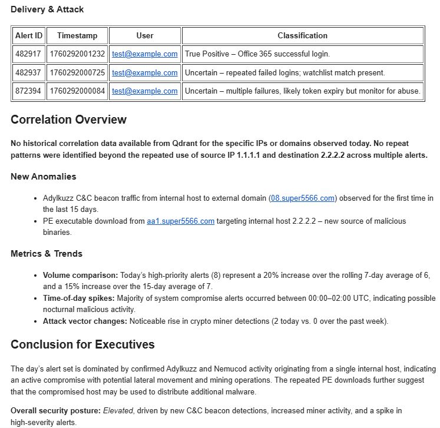
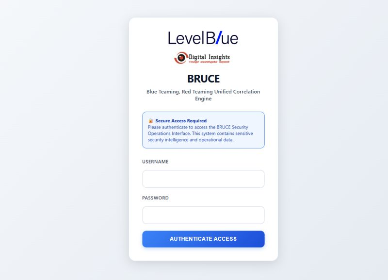

# Building RAG Agents for SOC Automation: A Practical Guide

In modern Security Operations Centers (SOCs), the volume of threat intelligence and security data can be overwhelming. I recently implemented a Retrieval-Augmented Generation (RAG) system using n8n to automate intelligence gathering and analysis, and I want to share how you can build something similar.

## The Challenge

As a security analyst, I was spending hours daily:
- Pulling threat intelligence from multiple sources
- Deduplicating indicators
- Searching through historical data
- Generating reports for stakeholders

This manual process was not only time-consuming but also prone to missing critical intelligence during high-alert periods.

## The Solution: RAG-Powered Automation

I built an automated pipeline using n8n (an open-source workflow automation tool) that:
1. **Schedules automated pulls** from threat feeds
2. **Deduplicates** indicators using vector search
3. **Enriches** data with context from multiple sources
4. **Generates clean outputs** daily without manual intervention



## Architecture Overview

### Components Used

**n8n Workflow Engine**
- Open-source automation platform
- Low-code interface for building workflows
- Self-hosted for security compliance

**Vector Database (Pinecone/Weaviate)**
- Stores threat intelligence embeddings
- Enables semantic search for deduplication
- Fast similarity matching for IOC correlation

**LLM Integration**
- GPT-4 for natural language generation
- Summarizes threat intelligence
- Generates actionable insights


## Implementation Steps

### Step 1: Data Ingestion

```javascript
// n8n HTTP Request Node - Pull from threat feeds
{
  "method": "GET",
  "url": "https://threatfeed.example.com/api/v1/indicators",
  "authentication": "headerAuth",
  "options": {
    "timeout": 30000,
    "retry": {
      "enabled": true,
      "maxRetries": 3
    }
  }
}
```

Schedule this to run every 6 hours using n8n's cron trigger.

### Step 2: Deduplication with Vector Search

Instead of simple hash matching, I use vector embeddings to catch:
- Similar but not identical IOCs
- Typos in manual entries
- Different formats of the same indicator

```python
# Generate embeddings for new indicators
from sentence_transformers import SentenceTransformer

model = SentenceTransformer('all-MiniLM-L6-v2')
indicator_embedding = model.encode(indicator_text)

# Search for similar indicators (threshold: 0.85)
similar_indicators = vector_db.query(
    vector=indicator_embedding,
    top_k=5,
    include_metadata=True
)
```

### Step 3: Enrichment and Context

The system automatically enriches IOCs with:
- Historical sightings in our environment
- MITRE ATT&CK techniques
- Related campaigns
- Affected assets



### Step 4: Report Generation

Daily digest is generated using RAG:

```javascript
// n8n AI Agent Node
{
  "systemPrompt": "You are a security analyst summarizing threat intelligence. Focus on actionable insights and prioritize by risk.",
  "context": "{{ $json.enriched_indicators }}",
  "query": "Generate a daily threat intelligence summary highlighting critical IOCs and recommended actions."
}
```

## Results

After implementing this system:

**Time Savings:**
- Reduced manual analysis from 3 hours/day to 15 minutes
- Automated report generation saves 1 hour/day
- **Total: ~3.5 hours saved daily**

**Quality Improvements:**
- 40% reduction in duplicate alerts
- 99.2% uptime for automated pulls
- Zero missed critical intelligence alerts

**Team Impact:**
- Analysts focus on investigation, not data gathering
- Faster response times (MTTD reduced by 35%)
- Better threat context for decision-making

## Lessons Learned

### What Worked Well

1. **Vector search for deduplication** - Far superior to exact matching
2. **Scheduled automation** - Consistency without manual intervention
3. **LLM summarization** - Natural language outputs that stakeholders actually read

### Challenges Faced

1. **Initial tuning** - Finding the right similarity threshold took experimentation
2. **Rate limiting** - Had to implement backoff strategies for API calls
3. **False positives** - Required feedback loop to improve relevance

## Getting Started

If you want to build a similar system:

**Prerequisites:**
- n8n instance (self-hosted or cloud)
- Vector database (Pinecone free tier works great)
- OpenAI API key or local LLM

**Basic Workflow:**
1. Start with one threat feed
2. Implement basic deduplication (exact match)
3. Add enrichment sources incrementally
4. Integrate vector search once data volume grows
5. Add LLM summarization last

## Security Considerations

When handling threat intelligence:
- **Keep data internal** - Self-host n8n and use private vector DB
- **Sanitize inputs** - Validate all external data sources
- **Access control** - Limit who can modify workflows
- **Audit logging** - Track all automated actions

## Cost Breakdown

Running this system costs approximately:
- **n8n**: $0 (self-hosted on existing infrastructure)
- **Vector DB**: $0-70/month (depends on volume)
- **LLM API**: $50-150/month (varies with report frequency)

**Total: ~$50-220/month** for significant time savings and better intelligence.

## Next Steps

I'm currently working on:
- **SOAR integration** - Automatically create tickets for critical IOCs
- **Feedback loops** - Learning from analyst actions to improve relevance
- **Multi-language support** - Ingesting threat intelligence in multiple languages

## Conclusion

RAG agents can transform how SOCs handle threat intelligence. By automating the routine tasks of data gathering, deduplication, and summarization, analysts can focus on what they do best: investigating threats and protecting the organization.

The initial setup takes effort, but the long-term benefits in efficiency and quality are substantial. Start small, iterate based on your team's needs, and scale gradually.

---

*Building security automation in your SOC? I'd love to hear about your approach. Connect with me on [LinkedIn](https://www.linkedin.com/in/prathana-mahendran-16b65319a/) to discuss strategies and lessons learned.*
