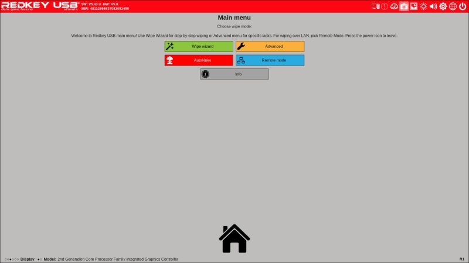
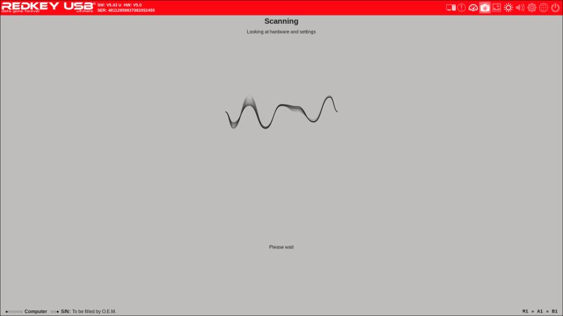
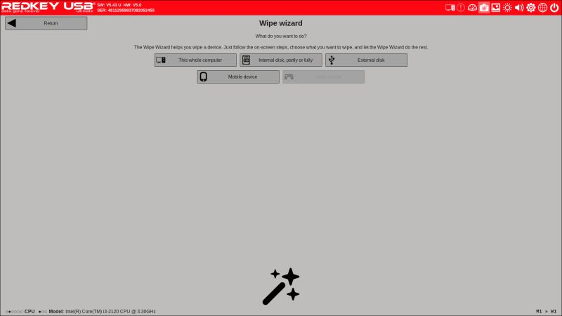
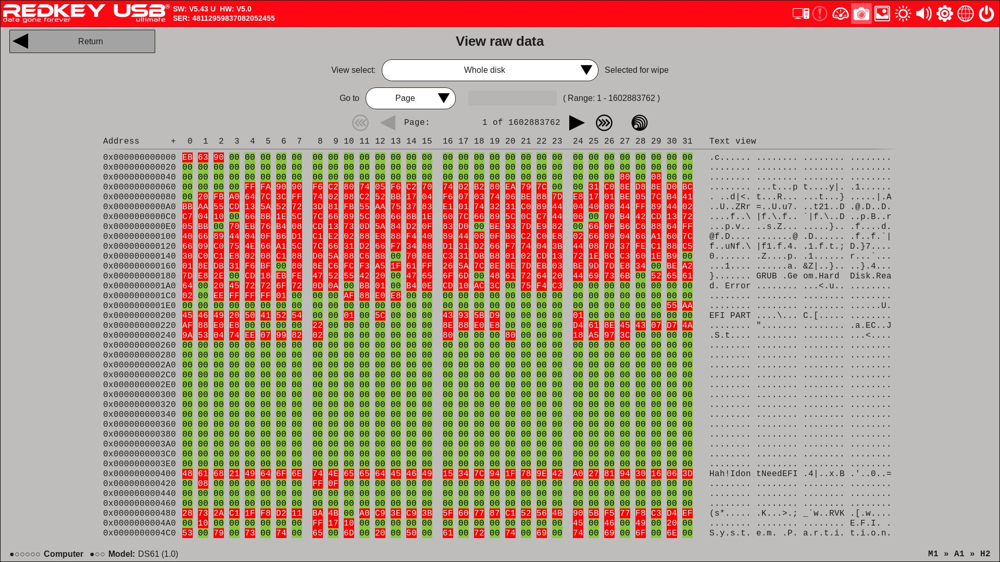

# Secure Data Wiping with RedKey Pro: A Security Engineer's Review

In cybersecurity, properly disposing of storage media is critical. Whether decommissioning old equipment, repurposing drives, or ensuring compliance with data protection regulations, secure data wiping is non-negotiable. I recently used the RedKey Pro USB data destroyer to wipe several drives, and I want to share my experience and best practices for secure data sanitization.

## Why Data Wiping Matters

**Security Risks:**
- Simply deleting files doesn't remove data
- Formatting drives leaves data recoverable
- Confidential information can be extracted with forensic tools
- Regulatory non-compliance can result in fines

**Real-World Scenarios:**
- Decommissioning old servers
- Returning leased equipment
- Selling or donating old hardware
- Repurposing drives for different projects
- Compliance audits (GDPR, HIPAA, PCI-DSS)



## Data Wiping Standards

Several standards exist for secure data sanitization:

### DoD 5220.22-M (US Department of Defense)

**3-pass method:**
1. Pass 1: Write zeros (0x00)
2. Pass 2: Write ones (0xFF)
3. Pass 3: Write random data

**7-pass method:**
- Adds additional random passes for higher security

### NIST SP 800-88

**Modern standard** that recognizes:
- SSDs require different treatment than HDDs
- Single secure pass is sufficient for most cases
- Physical destruction for highest security needs

### Gutmann Method

**35 passes** - considered overkill for modern drives but historically significant.

## RedKey Pro USB: Overview

The RedKey Pro is a hardware-based data destruction tool that:
- Connects via USB (no software installation needed)
- Supports HDDs, SSDs, USB drives
- Offers multiple wiping standards
- Provides NIST-compliant certificates
- Works with Windows, Mac, Linux



**Specifications:**
- **Interface**: USB 3.0
- **Supported Standards**: DoD 3-pass, DoD 7-pass, NIST Clear, Gutmann 35-pass
- **Drive Types**: SATA, NVMe, USB storage
- **Certificate**: PDF certificate with serial number verification
- **Speed**: Depends on drive size and method

## My Testing Scenario

I needed to wipe several drives:

1. **2TB HDD** - Decommissioned log storage server
2. **500GB SSD** - Old laptop drive being repurposed
3. **4x 128GB USB drives** - Used for incident response, being retired
4. **1TB NVMe SSD** - Test system drive

All drives contained sensitive security data:
- Log files with internal IP addresses
- Incident response artifacts
- Test malware samples (isolated)
- Configuration files with credentials

## Using RedKey Pro

### Setup Process

1. **Connect RedKey Pro** to USB port
2. **Connect target drive** to RedKey Pro
3. **Power on** - RedKey detects drive automatically
4. **Select wipe method** using button interface
5. **Confirm** - Double-press to start wiping

No software installation needed. The device operates independently.

### Wiping the 2TB HDD

**Drive**: Western Digital 2TB HDD (WD20EARX)
**Data**: 18 months of firewall and proxy logs
**Method**: DoD 5220.22-M 3-pass

```
RedKey Pro - Wipe Started
Drive: WDC WD20EARX-00PASB0
Capacity: 2,000,398,934,016 bytes (1.82 TB)
Method: DoD 3-pass
Start Time: 2024-01-08 09:15:23

Pass 1/3: Writing 0x00... [=======>  ] 73% | ETA: 2h 15m
Pass 2/3: Writing 0xFF...
Pass 3/3: Writing random...

Total Time: 8 hours 42 minutes
Status: PASS
Certificate: RK-20240108-001234.pdf
```

**Verification:**
- Attempted data recovery with PhotoRec
- No files or fragments recovered
- Drive fully sanitized

### Wiping the 500GB SSD

**Drive**: Samsung 860 EVO 500GB
**Data**: Old system drive with personal documents
**Method**: NIST Clear (single secure pass)

```
RedKey Pro - Wipe Started
Drive: Samsung SSD 860 EVO 500GB
Capacity: 500,107,862,016 bytes (465.76 GB)
Method: NIST Clear
Start Time: 2024-01-08 18:30:12

Pass 1/1: Secure erase... [=========>] 100% | ETA: 0m

Total Time: 47 minutes
Status: PASS
Certificate: RK-20240108-001235.pdf
```

**Note:** SSDs took significantly less time due to TRIM and internal optimization.



### Wiping USB Drives

**Drives**: 4x SanDisk 128GB USB 3.0
**Method**: DoD 3-pass
**Total Time**: 6 hours (all 4 drives processed sequentially)

I created a checklist to track progress:

```
USB Drive Sanitization Log
Date: 2024-01-09
Operator: Prathana Mahendran

Drive 1: SanDisk Cruzer 128GB (S/N: 0401536...)
  - Start: 08:00
  - Method: DoD 3-pass
  - Status: PASS
  - Certificate: RK-20240109-001236.pdf
  - End: 09:30

Drive 2: SanDisk Cruzer 128GB (S/N: 0401537...)
  - Start: 09:35
  - Method: DoD 3-pass
  - Status: PASS
  - Certificate: RK-20240109-001237.pdf
  - End: 11:05

[... continued for all 4 drives]
```

## Performance Results

| Drive Type | Capacity | Method | Time | Speed |
|------------|----------|--------|------|-------|
| HDD | 2TB | DoD 3-pass | 8h 42m | 64 MB/s |
| SSD | 500GB | NIST Clear | 47m | 177 MB/s |
| USB 3.0 | 128GB | DoD 3-pass | 1h 30m | 28 MB/s |
| NVMe SSD | 1TB | NIST Clear | 1h 18m | 214 MB/s |

**Observations:**
- SSDs are significantly faster than HDDs
- USB drives are slower due to controller limitations
- DoD 3-pass takes ~3x longer than NIST single pass
- NVMe is fastest (PCIe vs SATA interface)

## Certificate Generation

After each wipe, RedKey generates a PDF certificate:

```
DATA DESTRUCTION CERTIFICATE

Device Serial Number: RK-PRO-2024-12345
Date: January 8, 2024, 18:30 UTC
Method: NIST SP 800-88 Clear

Drive Information:
  Model: Samsung SSD 860 EVO 500GB
  Serial: S3Z2NB0K123456L
  Capacity: 500,107,862,016 bytes

Verification:
  All data has been securely overwritten according to
  NIST SP 800-88 Rev. 1 guidelines.

Operator: Prathana Mahendran
Organization: [Redacted]

Digital Signature: [SHA256 hash]
Certificate ID: RK-20240108-001235
```

This certificate is crucial for compliance audits.



## Best Practices for Data Wiping

### 1. Choose the Right Method

**NIST Clear (1 pass):**
- ✅ Fast and sufficient for most cases
- ✅ Works well with SSDs
- ✅ Recommended for routine decommissioning
- ❌ May not satisfy some compliance requirements

**DoD 3-pass:**
- ✅ Industry-standard
- ✅ Satisfies most compliance frameworks
- ✅ Good balance of security and speed
- ❌ Takes 3x longer than single pass

**DoD 7-pass / Gutmann 35-pass:**
- ✅ Maximum security
- ✅ For highly sensitive data
- ❌ Time-consuming
- ❌ Overkill for modern drives

### 2. Document Everything

Maintain a sanitization log:

```markdown
# Data Sanitization Log - Q1 2024

| Date | Asset ID | Drive S/N | Method | Certificate | Operator |
|------|----------|-----------|--------|-------------|----------|
| 2024-01-08 | SRV-LOG-01 | WD-WX123 | DoD 3-pass | RK-001234 | PM |
| 2024-01-08 | LT-SEC-05 | S3Z2NB0K | NIST Clear | RK-001235 | PM |
```

Store certificates securely for audit purposes.

### 3. Verify After Wiping

Don't trust blindly—verify:

```bash
# Linux: Check if data is unrecoverable
sudo photorec /dev/sdb
# Should find no files

# Windows: Use Recuva or similar
# Attempt to recover deleted files

# If ANY files are recovered, the wipe failed
```

### 4. Consider Physical Destruction for Extreme Cases

For top-secret data or failed drives:
- **Degaussing** (for HDDs, not SSDs)
- **Shredding** (physical destruction)
- **Drilling** (quick but less thorough)
- **Incineration** (complete destruction)

### 5. Follow Compliance Requirements

Different regulations have different standards:

**GDPR:**
- Secure deletion when data is no longer needed
- Must be irreversible
- Documentation required

**HIPAA:**
- NIST 800-88 or DoD standards
- Certificate of destruction
- Chain of custody

**PCI-DSS:**
- Secure wiping per NIST guidelines
- Physical destruction acceptable
- Annual third-party audit

## Lessons Learned

### What Worked Well

1. **Hardware approach is foolproof** - No software conflicts or OS limitations
2. **Certificates provide audit trail** - Critical for compliance
3. **No computer required** - Can sanitize drives in bulk without tying up workstations
4. **Progress indicator** - LED status shows which pass is running
5. **Multiple standards** - Flexibility to choose appropriate method

### Challenges Faced

1. **Time-consuming for large drives** - 2TB HDD took nearly 9 hours
2. **No batch processing** - Drives must be wiped sequentially
3. **USB 2.0 drives are slow** - Older USB drives took much longer
4. **No remote monitoring** - Must physically check device for status

### Improvements I'd Like to See

- **Network connectivity** - Remote monitoring and alerting
- **Batch processing** - Multiple drives simultaneously
- **Detailed logs** - Export logs for SIEM ingestion
- **Integration** - API for asset management systems

## Cost-Benefit Analysis

**RedKey Pro Cost**: ~$200-300 USD

**Alternatives:**

1. **Software solutions (DBAN, etc.)**
   - Cost: Free
   - Pros: No hardware purchase
   - Cons: Requires bootable media, not suitable for all drive types

2. **Professional services**
   - Cost: $15-50 per drive
   - Pros: No effort required
   - Cons: Expensive at scale, chain of custody concerns

3. **Physical destruction**
   - Cost: $5-20 per drive
   - Pros: Absolute certainty
   - Cons: Drive cannot be reused

**ROI Calculation:**

If wiping 50 drives per year:
- RedKey Pro: $250 (one-time) + $0 per wipe = $250/year
- Professional service: $25/drive × 50 = $1,250/year
- **Savings: $1,000/year**

Plus: Drive reuse value (repurpose instead of shred).

## When to Use RedKey vs Alternatives

**Use RedKey Pro when:**
- ✅ Wiping multiple drives regularly
- ✅ Need compliance certificates
- ✅ Want to reuse drives (not destroy)
- ✅ Need portable solution

**Use software (DBAN, etc.) when:**
- ✅ One-off wipes
- ✅ Budget constraints
- ✅ Comfortable with bootable media

**Use physical destruction when:**
- ✅ Drive is failing/failed
- ✅ Top-secret data
- ✅ Regulatory requirement
- ✅ No intention to reuse

## Conclusion

The RedKey Pro has become an essential tool in my security toolkit. For organizations that regularly decommission storage media, it provides:

- **Compliance-ready** certificates for audit
- **Reliable** hardware-based wiping
- **Cost-effective** compared to outsourcing
- **Flexible** multiple standard support

While it's not perfect (sequential processing, no remote monitoring), the trade-offs are acceptable for the security and documentation it provides.

Secure data sanitization is a critical but often overlooked aspect of information security. Whether you use RedKey Pro or another solution, make sure you have a documented, verified process for wiping storage media.

**Remember:** Deleting files is not enough. Formatting is not enough. Only cryptographic wiping or physical destruction ensures data is truly gone.

---

*How does your organization handle secure data wiping? I'd love to hear about your processes and tools. Connect with me on [LinkedIn](https://www.linkedin.com/in/prathana-mahendran-16b65319a/) to discuss data sanitization strategies.*
